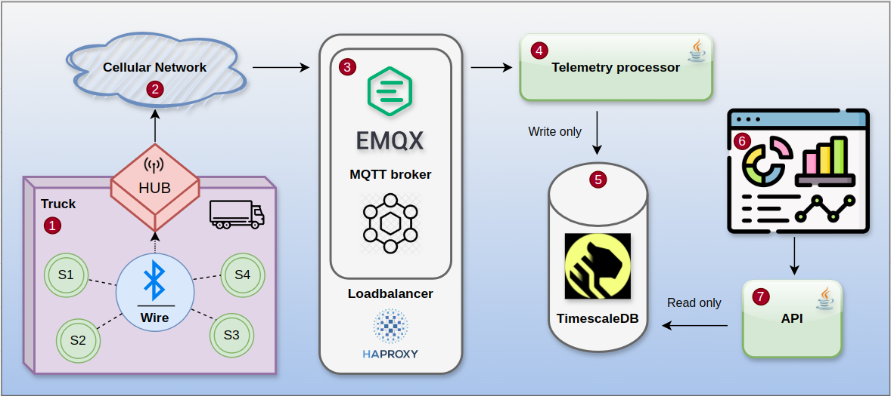

# Problem
Once I worked on a project where we were collecting sensors telemetry to monitor customers fleet 
and built dashboards on that data. Our solution worked but there was a big room to make it better. 
So, I decided to make my own _modern_ solution. Here is a brief overview of the challenges:
- What protocol we should use to handle the telemetry?
- What database we should use for write-heavy load and histogram-like queries?
- What message broker?
- How to make the solution scalable and resilient? Say, we are facing data center outage or growing telemetry load.

## Technical implementation
- TimescaleDB(based on Postgres 17) as the primary database
- MQTT protocol. There are two implementations:
  - main branch - MQTT 5.0(we use its _shared subscription_ feature for scalability)
  - mqtt3_1_1 branch - MQTT 3.1.1
- EMQX cluster for resiliency(2 nodes)
- HAProxy for load balancing
- Spring Boot 3.4.1
- Java 21
- Flyway migrations
- Simple JDBC
- Docker and Docker Compose

## Architecture

- Each vehicle(like a truck) has a few sensors: speed, fuel, mileage, temperature and one hub. 
The sensors are connected to the hub via bluetooth or wire. Note, I am not an embedded developer, 
that is only my current vision of the concept how the _truck part_ can be implemented.
- The hub has access to the Cellular Network via 3-5G and able to transmit data into EMQX cluster via MQTT protocol. 
In the demo we use user/password authentication.
- Every hub connects to the EMQX cluster via HAProxy to loadbalance traffic(round-robin).
- The telemetry stream is handled by Telemetry Processor. It basically just stores data into a database by batches.
- TimescaleDB handles the heavy-write load and stores data into _hypertable_ and applies compression. 
TimescaleDB is an extension for Postgres. You can find relevant information via links to the official documentation in 
Flyway migration [script](https://github.com/ggruzdov/fleet-monitoring/blob/main/processor/src/main/resources/db/migration/V1.0__init.sql).
- The last part of the demo is API service for querying examples. Note, there is no dashboard UI, see [Usage Examples](#usage-examples).

## Repository overview
There are four directories:
1. __api__ - simple Spring WebMVC project to query aggregated data from DB.
2. __feeder__ - emulates sensors telemetry and sends it into the _metrics_ topic.
3. __processor__ - handles sensors telemetry from the _metrics_ topic and stores it into DB.
4. __infra__ - docker compose and config files for all the infrastructure used in the project.

# Getting started

### Prerequisites
- Unix-like operating system(for Windows just manually execute commands from shell scripts and use `mvnw.cmd` instead)
- Docker and Docker Compose
- `jq` tool (optional, for pretty-printing JSON responses in the usage examples down below)

### Installation

1. **Build the project**
```bash
./build.sh
```

2. **Start the application**
```bash
docker compose up -d
```
**NOTE:** in the root _compose.yml_ there are 4 feeders, each of them emulates 100 vehicles, each vehicle generates 4 metrics, 
so the initial setup produces ~800 messages per second. I tested locally(Intel i7-1165G7) 1000 vehicles per feeder 
which give us ~8k msg/sec and there was not throttling or message drops. You can play around by changing environment variables. 
However, be causes as **feeding is very CPU-consuming and there is no validation of input parameters**, so don't go crazy with it 
on your local machine. Some tip: the more vehicles you set the bigger batch size should be in _processor_(see its variables).

API will be available at: `http://localhost:8080`

Database credentials:
```
URL: jdbc:postgresql://localhost:5432/metrics
Username: user
Password: password
```

EMQX dashboard:
```
URL: http://localhost:18083
Username: admin
Password: public
```

HAProxy stats page:
```
URL: http://localhost:1936/stats
Username: admin
Password: password
```

3. **Stop the project**
```bash
docker compose down
```

4. **Clean up**
```bash
./clean.sh  # Removes local docker images
```

## Usage examples
**NOTE:** there are no pre-generated data in DB, so run the project and wait a couple of minutes to feed some data. 
Put your current timestamp in UTC timezone into requests. Requests with _interval_ parameter assume _minutes_ and there is 
no pagination for them.

### Average speed for period
```bash
curl 'http://localhost:8080/avg/speed?vehicleId=1&from=2025-02-01T13:04:00.000Z&to=2025-02-01T13:15:00.000Z' | jq .
```

### Max temperature for period
```bash
curl 'http://localhost:8080/max/temperature?vehicleId=1&from=2025-02-01T13:04:00.000Z&to=2025-02-01T13:15:00.000Z' | jq .
```

### Total mileage for period
```bash
curl 'http://localhost:8080/total/mileage?vehicleId=1&from=2025-02-01T13:04:00.000Z&to=2025-02-01T13:15:00.000Z' | jq .
```

### Fuel indicator every minute
```bash
curl 'http://localhost:8080/histogram/max/fuel?vehicleId=1&from=2025-02-01T13:04:00.000Z&to=2025-02-01T13:15:00.000Z&interval=1' | jq .
```

### Temperature changes every minute
```bash
curl 'http://localhost:8080/histogram/max/temperature?vehicleId=1&from=2025-02-01T13:04:00.000Z&to=2025-02-01T15:10:00.000Z&interval=1' | jq .
```

## Future Improvements
1. Add SSL/TLS and granular authorization
2. Add _will_ on disconnects